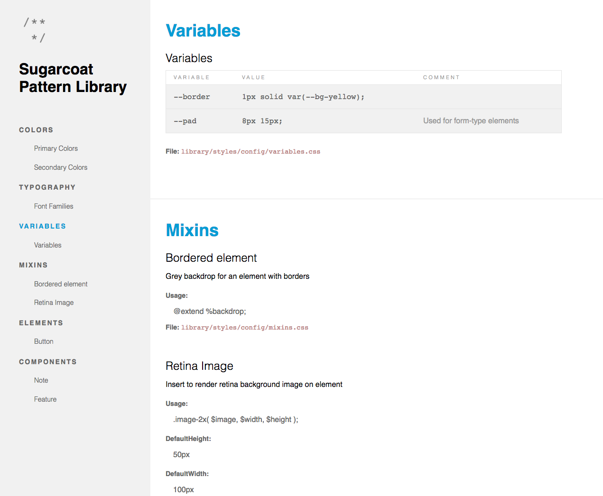
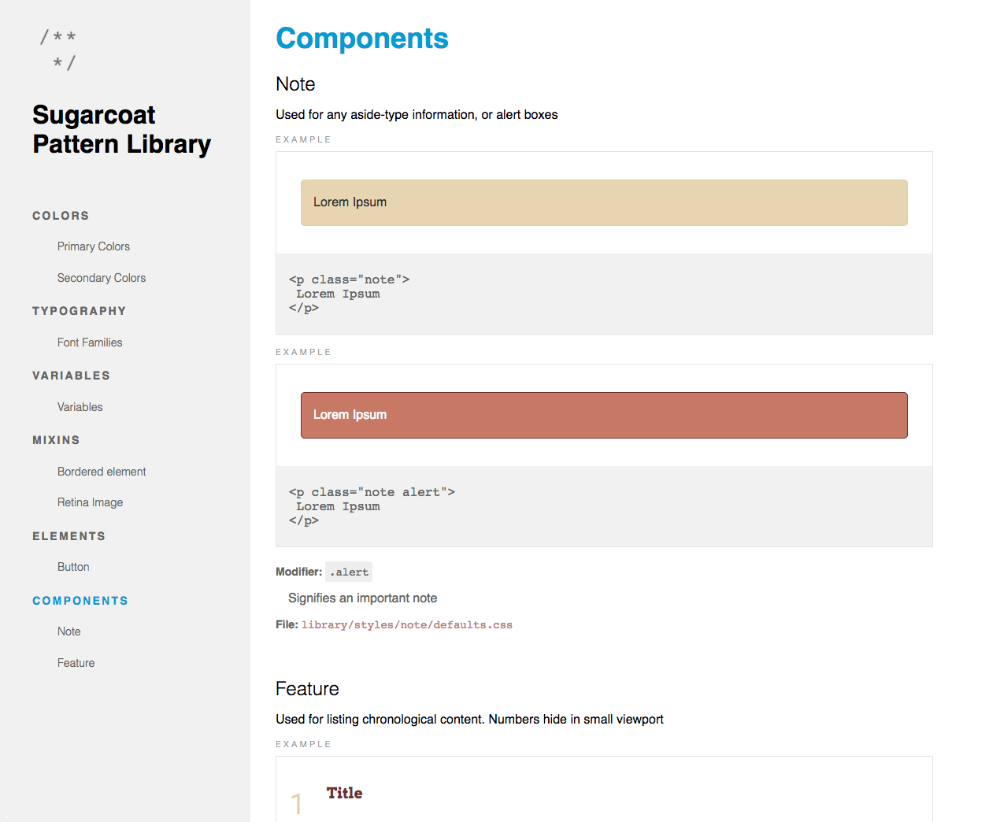

# Sugarcoat #

[](https://www.npmjs.com/package/sugarcoat) [](https://david-dm.org/sapientnitrola/sugarcoat)

Making UI documentation a bit sweeter ✨

Sugarcoat was created to enable developers to produce rich UI documentation easily and with minimal up-keep. Sugarcoat works by parsing project files for documentation comments (similar to JavaDoc, JSDoc, etc.) and generates a responsive HTML site or JSON that is organized and easy to read. Sugarcoat allows developers and designers access to up-to-date previews of UI elements, page components, project specific colors and typography, all in one place.

**Note**: This is still a [work in-progress](#v100). Please file an issue if you encounter any issues or think a feature should be added.







# Index #

  - [Features](#features)
  - [Install](#install)
  - [Usage](#usage)
    - [Module](#module)
    - [CLI](#cli)
  - [Configuration](#configuration)
    - [`settings` Object](#settings-object)
    - [Advanced `settings` Example](#advanced-settings-example)
    - [`sections` Array](#sections-array)
    - [Standardized File Format](#standardized-file-format)
  - [Code Comment Syntax](#code-comment-syntax)
  - [Templating](#templating)
    - [Custom Templating](#custom-templating)
  - [Example Site](#example-site)
  - [Roadmap](#roadmap)


---

# Features✨ #

1. Lives in your project seamlessly

  Sugarcoat will never force a file/project structure on you, nor make you create extra files for it to work.

2. [Universal Comment Syntax](#code-comment-syntax)

  Sugarcoat parses all **comment blocks** in the file(s) you specify with JSDoc commenting syntax. Or you can specify your own delimiters.

3. [Easy-to-identify component states](#code-comment-syntax)

  If you declare CSS modifier states within your comment block, Sugarcoat will highlight and display them in your pattern library for extra readability.

4. [Variables Galore](#type)

  Sugarcoat will understand your variables if they're SCSS, LESS, or [CSS Custom Property](https://www.w3.org/TR/css-variables/#defining-variables)

5. [Customizable Layout](#custom-templating)

  Sugarcoat allows you to define your own layout, partials and assets.


# Install #

```bash
npm install --save sugarcoat
```


# Usage #

## Module API ##

The Sugarcoat module takes a `config` object and returns a `Promise`. The Promise resolves to the original `config` object, expanded to contain the data from your parsed sections.

```js
const sugarcoat = require( 'sugarcoat' );

sugarcoat( config );

// or

sugarcoat( config ).then( function( data ) {
    console.log( data );
});
```

## CLI ##

You can also install the Sugarcoat command globally (via `npm install -g sugarcoat`). The `sugarcoat` command takes a path to a configuration file which must export the configuration object.

```bash
sugarcoat 'path/to/config.js'
```

**Options**

```bash
sugarcoat [flags] <configuration file>

Options:

  -h, --help     output usage information
  -V, --version  output the version number
```


# Configuration #


**Simple Example**

```js
{
  settings: {
    dest: 'path/to/dest'
  },
  sections: [
    {
      title: 'Base',
      files: [
        'path/to/styles/typography/*.css'
        'path/to/styles/variables/*.css'
      ]
    },
    {
      title: 'UI',
      files: 'path/to/styles/molecules/**/*.css'
    }
  ]
}
```

## `settings` Object ##

This object holds general configuration values.

### `cwd` ###

  - Required: No
  - Type: `String`
  - Default: `process.cwd()`

Path to which `dest` is relative.

### `dest` ###

  - Required: Yes
  - Type: `String`
  - Default: `null`
  - Relative: `settings.cwd`

Directory to which Sugarcoat will output the results. This path is relative to `cwd`. Sugarcoat will create any directories that do not already exist.

### `graphic` ###

  - Required: No
  - Type: `String`
  - Default: `null`

Path to the image to be rendered in the heading of your pattern library.

### `log` ###

  - Required: No
  - Type: `Object`

Configure Sugarcoat's logging properties. See [npm/npmlog](https://github.com/npm/npmlog#loglevel) for more info.

### `prefix.assets` ###

  - Required: No
  - Type: [Standardized File Format](#standardized-file-format)
  - Default: `null`
  - Relative: [`settings.cwd`](#cwd)

CSS file(s) you wish Sugarcoat to prefix with `prefix.selector`. The newly prefixed stylesheets will be placed in your document in the order you declare them.

### `prefix.selector` ###

  - Required: No
  - Type: `String`
  - Default: `.sugar-example`

Define the selector to be used to prefix all assets from `prefix.assets`. Should a user choose to develop their own [pattern library templates](#custom-templating), they can designate their own selector prefix.

### `template.cwd` ###

  - Required: No
  - Type: `String`
  - Default: Sugarcoat's theme directory

The base path to which all `template` paths are relative.

### `template.layout` ###

  - Required: No
  - Type: `String`
  - Default: `main.hbs` (provided by Sugarcoat)
  - Relative: `template.cwd`

Path to the Handlebars layout that will define the layout of the site.

### `template.partials` ###

  - Required: No
  - Type: [Standardized File Format](#standardized-file-format)
  - Default: See [templating](#templating) for a list of Sugarcoat's provided partials.
  - Relative: `template.cwd`

Partial file(s) to register with Handlebars. If any partials use a [reserved name](#reserved-partial-names), the respective partial will override the one provided by Sugarcoat.

### `template.assets` ###

  - Required: No
  - Type: [Standardized File Format](#standardized-file-format)
  - Default: `sugarcoat`
  - Relative: `template.cwd`

Static asset file(s) to copy to `settings.dest`. If you would like to use Sugarcoat's default pattern library assets, as well as your own, just include `sugarcoat` in the asset array.

### `title` ###

  - Required: No
  - Type: `String`
  - Default: 'Pattern Library'

The value displayed as the heading of your pattern library.


## `sections` Array ##

Contains an `Array` of [Section Objects](#section-object).

### Section Object ###

[TODO]

### `files` ###

  - Required: Yes
  - Type: [Standardized File Format](#standardized-file-format)

File(s) to parse for [documentation comments](#code-comment-syntax). Sugarcoat uses [globby](https://www.npmjs.com/package/globby) to enable pattern matching.


### `title` ###

  - Required: Yes
  - Type: `String`

Heading of the section.


### `mode` & `template`###

#### `mode` ####

  - Required: No
  - Type: `String`
  - Default: `undefined`

By default, all files are parsed only for their comment blocks. By using `'variable'` mode, Sugarcoat will parse your stylesheet's variable declarations as well. This works with variables prefixed with `$`, `@`, or `--`, depending on the stylesheet's file extension.

#### `template` ####

  - Required: No
  - Type: `String`
  - Default: `section-default`

The default partial name used to display parsed comments is `section-default`. If `mode` is provided, the default partial name used is `section-variable`. `mode` has two alternate variable renderings available: `section-color` and `section-typography`. If you'd like this section to use a custom partial, provide its name to this option. Be sure to register your custom partial in [settings.template.partials`](#templatepartials). For more information on this, see [Custom Templating](#custom-templating).

**`mode` & `template` relationships**

| Mode        | Template             | Description |
|-------------|----------------------|--------------------------------------------------------------------------------------------------------------------------------------------------------------|
| 'undefined' | 'section-default'    | Default |
| 'variable'  | 'section-variable'   | Parses file for variables depending on the stylesheet's file extension. Renders as a simple table. Inline comments are treated as the variable's description |
| 'variable'  | 'section-color'      | Parses file for variables depending on the stylesheet's file extension. Renders variables into color swatches. Inline comments are treated as the variable's description |
| 'variable'  | 'section-typography' | Parses file for variables depending on the stylesheet's file extension. Renders variables into typography examples. Inline comments are treated as the variable's description |


**Examples**

Parse all variables in my file:

```js
{
    title: 'Project Defaults',
    files: 'path/to/global/vars.scss',
    mode: 'variable'
}
```

Parse all variables in my file. Render them using the 'section-color' partial.

```js
{
    title: 'Colors',
    files: 'path/to/global/colors.scss',
    type: 'variable',
    template: 'section-color'
}
```


## Standardized File Format ##

Throughout Sugarcoat we use a standardized format for files. This format allows the user to express a file in three different ways: `String`, `Array`, and `Object`.

### `String` ###

A path or pattern [(Globby)](https://github.com/sindresorhus/globby#globbing-patterns) to a location.

**Example**
```js
files: 'path/to/js/*'
```

### `Array` ###

Provide a series of Standardized File Formats ([`Strings`](#string) and/or [`Objects`](#object)).

**Example**
```js
files: [
  'path/to/main.js',
  {
    src: 'path/to/main.js',
    options: {
      nodir: true
    }
  }
]
```

### `Object` ###

Provide more globbing options in addition to the standardized patterns. See [Globby](https://github.com/sindresorhus/globby).


**Example**
```js
files: {
  src: 'path/to/main.js',
  options: {
    nodir: true
  }
}
```

# Code Comment Syntax #

Sugarcoat uses [comment-serializer](https://www.npmjs.com/package/comment-serializer) to parse your file comments. Here is an example of the default syntax:

```css
/**
 * @title Tooltip
 * @example
 *  <div class="tooltip">
 *    <span class="tooltip-content">This is a tooltip</span>
 *  </div>
 * @modifier .active enabled class on .tooltip
 * @state :focus allows visual contrast for accessibility
 */
```


Sugarcoat will parse any tag it finds into a key/value pair. For example: `@tag value`.

The exception being the following three reserved tags that are demonstrated in the above example:

  - **`@example`** Takes a single or multiline code example.

  - **`@modifier`** Used for a class modifier on a component: `@modifier <selector> <description>`.

  - **`@state`** Used for state pseudo-classes such as `:hover`: `@state :<pseudo-class> <description>`.

If you would like to include a custom tag in your comment block, you can pass a custom parser into [comment-serializer](https://github.com/ryanfitzer/comment-serializer#custom-tag-parsers).


**HTML**

For html files, Sugarcoat uses the same comment style. Since HTML doesn't support this style you'll need to wrap your documentation comments with an HTML-style comment.

**Comment Example (html)**

```html
<!--
/**
 * @title Some Component
 * @description This component has a description
 * @dependencies /path/to/some-component.js
 */
-->
<div class="some-component">
  <span>I'm a Component!</span>
</div>
```


# Roadmap #

## v1.0.0 ##

- [x] [More styling and better structuring of rendered sections]
- [x] [Robust example project]
- [x] [Consolidating code comment syntax strategy]
- [x] [Standardize file syntax in `settings` to align with the `file` syntax in section objects]
- [x] [Consume your style assets, prefix them, and place them into `head.hbs`]
- [ ] [Add automated tests](/../../issues/18)
- [ ] [Remove Format option from settings object](../../issues/32)
- [ ] Custom Templating
- [ ] Refine settings object
- [ ] Syntax Highlighting


## v?.0.0 ##

- [x] Ability to add custom tags [comment-parser](https://github.com/ryanfitzer/comment-serializer)
- [ ] More refactoring of modules (functional, Promises)
- [ ] Add support for JavaScript modules and components (React)
