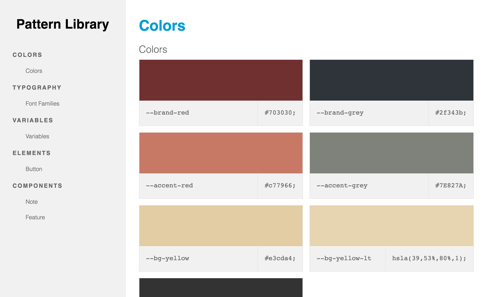
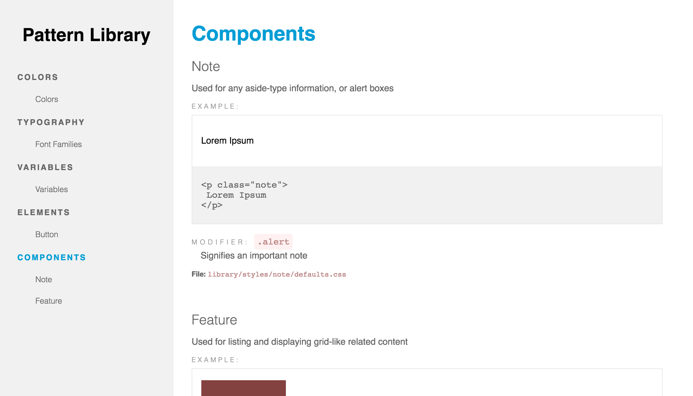

# Sugarcoat #

[](https://www.npmjs.com/package/sugarcoat) [](https://david-dm.org/sapientnitrola/sugarcoat)

Making UI documentation a bit sweeter ✨

Sugarcoat was created to enable developers to produce rich UI documentation easily and with minimal up-keep. Sugarcoat works by parsing project files for documentation comments (similar to JavaDoc, JSDoc, etc.) and generates a responsive HTML site or JSON that is organized and easy to read. Sugarcoat allows developers and designers access to up-to-date previews of UI elements, page components, project specific colors and typography, all in one place.

**Note**: This is still a [work in-progress](#v100). Please file an issue if you encounter any issues or think a feature should be added.






# Index #

  - [Features](#features)
  - [Install](#install)
  - [Usage](#usage)
    - [Module](#module)
    - [CLI](#cli)
  - [Configuration](#configuration)
    - [`settings` Object](#settings-object)
    - [`sections` Array](#sections-array)
    - [Standardized File Format](#standardized-file-format)
  - [Code Comment Syntax](#code-comment-syntax)
  - [Templating](#templating)
    - [Custom Templating](#custom-templating)
  - [Roadmap](#roadmap)


---

# Features #

1. Lives in your project seamlessly

  Sugarcoat will never dictate your project. It will never force a file/project structure, nor will it ever make you have to create extra files for it to work. Sugarcoat will live within your project seamlessly.

2. [Universal Comment Styles](#code-comment-syntax)

  Sugarcoat will parse *all* comment blocks in the file(s) you specify, excluding inline comments. You can use the same JSDoc commenting syntax across all file types. But if you don't want to use JSDoc syntax, you can specify your own delimiters.

3. [Easy-to-identify component states](#code-comment-syntax)

  You can tell sugarcoat that there are modifier states in your css, right within your comment block! Sugarcoat will help highlight and display them for extra readability.

4. [Variables Galore](#type)

  Sugarcoat will still understand your variables if they're SCSS, LESS, or even future specs: `--my-var`.

5. [No Style Bleed](#prefixassets)

  The styles that come out of the box with Sugarcoat will not allow for any bleeding of styles into your components or modules. To ensure that your project styles don't bleed, you can provide Sugarcoat with an array of assets for it to prefix. Note: We chose not to use iframes because of their unpredictible resizing (such as a custom dropdown)

6. [Customizable Templates](#custom-templating)

  Sugarcoat allows you to define your own templates, partials and assets.


# Install #

```bash
npm install --save sugarcoat
```


# Usage #

The Sugarcoat module takes a `config` object and returns a `Promise`. By default, the `resolve` callback provided to the `.then` method receives the expanded `config` object with the parsed sections data.

```js
var sugarcoat = require( 'sugarcoat' );

sugarcoat( config );

// or

sugarcoat( config ).then( function( data ) {
    console.log( data );
});
```

# Configuration #


**Simple Example**

```js
{
  settings: {
    title: 'My Pattern Library',
    graphic: 'my/project/library/images/logo.jpg',
    dest: 'my/project/pattern-library'
  },
  sections: [
    {
      title: 'Components',
      files: 'my/project/components/*.html'
    },
    {
      title: 'UI Kit',
      files: [
        'my/project/library/styles/global/*.scss',
        'my/project/library/styles/components/feedback.scss',
        '!my/project/library/styles/global/typography.scss'
      ]
    }
  ]
}
```

## `settings` Object ##

This object holds general configuration values.


### `title` ###

Type: `String`
Optional: `true`
Default: `null`

This is the title of your pattern library. It will be displayed in the rendered version of Sugarcoat.

### `graphic` ###

Type: 'String'
Optional: `true`
Default: `null`

This is the path to an image that can be the logo or letterhead for your pattern library. It will be displayd in the rendered version of Sugarcoat.

### `cwd` ###

Type: `String`
Optional: `true`
Default: `process.cwd()`

This is the path to which the `dest` path is relative.

### `dest` ###

Type: `String`
Optional: `false`
Default: `null`

Directory to which Sugarcoat will output the results. This path is relative to `cwd`. Sugarcoat will create any directories that do not already exist. If given the option 'none', Sugarcoat will not output a rendered pattern library. 

### `log` ###

Type: `Object`
Optional: `true`

Configure Sugarcoat's logging properties. See [npm/npmlog](https://github.com/npm/npmlog#loglevel) for more info.

### `template.cwd` ###

Type: `String`
Optional: `true`
Default: Sugarcoat's theme directory

The base path to which all `template` paths are relative.

### `template.layout` ###

Type: `String`
Optional: `true`
Default: `main.hbs` (provided by Sugarcoat)
Relative: `template.cwd`

Path to the Handlebars layout that will define the layout of the site.

### `template.partials` ###

Type: [Standardized File Format](#standardized-file-format)
Optional: `true`
Default: See [templating](#templating) for a list of Sugarcoat's provided partials.
Relative: `template.cwd`

Partial file(s) to register with Handlebars. If any partials use a [reserved name](#reserved-partial-names), the respective partial will override the one provided by Sugarcoat.

### `template.assets` ###

Type: [Standardized File Format](#standardized-file-format)
Optional: `true`
Default: `sugarcoat`
Relative: `template.cwd`

Static asset file(s) to copy to `settings.dest`. If you would like to use Sugarcoat's default pattern library assets, as well as your own, just include `sugarcoat` in the asset array.

### `prefix.assets` ###

Type: [Standardized File Format](#standardized-file-format)
Optional: `true`
Default: `null`
Relative: `settings.cwd`

CSS file(s) you wish Sugarcoat to prefix with a selector. The newly scoped stylesheets will be placed into a `<link>` tag in Sugarcoat's `head.hbs` partial.

### `prefix.selector` ###

Type: `String`
Optional: `true`
Default: `.sugar-example`

Defines the selector to be used to prefix all assets from `prefix.assets`. Should a user choose to develop their own [custom pattern library templates](#custom-templating), they can designate their own selector scope.

**Advanced Example**

```js
module.exports = {
  settings: {
    dest: 'my/project/pattern-library',
    template: {
      cwd: 'my/project/templates',
      layout: 'my-custom-layout.hbs',
      partials: [
        {
          src: 'my-partials',
          options: {
            nodir: false
          }
        },
        {
          src: 'my-other-partials',
          options: {
            nodir: false
          }
        }
      ],
      assets: [
        'sugarcoat',
        'js',
        'styles',
        'images'
      ]
    },
    prefix: {
      assets: [
        'styles'
      ],
      selector: '.scope-styles'
    }
  },
  sections: [ <...> ]
}
```


## `sections` Array ##

Contains an `Array` of [Section Objects](#sectionobject)

### Section Object ###

#### `title` ####

Type: `String`
Optional: `false`

Title of section.

#### `files` ####

Type: [Standardized File Format](#standardized-file-format)
Optional: `false`

File(s) that contain documentation comments you would like to be parsed. Sugarcoat uses [globby](https://www.npmjs.com/package/globby) to enable pattern matching.

**Examples**

Provide a single path:

```js
{
  title: 'Single File',
  files: 'my/project/styles/components/feedback.scss'
}
```

Match all files in a directory:

```js
{
  title: 'Multiple Files',
  files: 'my/project/styles/base/*'
}
```

Provide multiple paths/patterns:

```js
{
  title: 'Multiple Files',
  files: [
    'my/project/styles/global/*',
    'my/project/styles/components/feedback.scss',
    '!my/project/styles/global/colors.scss'
  ]
}
```

Provide an object in order to specify options to pass to [globby](https://www.npmjs.com/package/globby):

```js
{
  title: 'Multiple Files',
  files: {
    src: String|Object|Array,
    options: Object
  }
}
```

Provide an array of objects:

```js
{
  title: 'Multiple Files',
  files: [
    {
      src: String|Object|Array,
      options: Object
    },
    {...}
  ]
}
```

#### `type` ####

Type: `String`
Optional: `true`
Default: `default`

If you'd like to parse a preprocessed stylesheet's variables, provide the `variable` option. This works with variables prefixed with `$`, `@`, or `--`.

```js
{
    title: 'Project Defaults',
    files: 'my/project/styles/global/vars.scss',
    type: 'variable'
}
```

#### `template` ####

Type: `String`
Optional: `true`
Default: depends on the value of `type`

The default partial is `section-default`, or `section-variable` when the `type` property is `variable`. Two alternate variable renderings are available: `section-color` and `section-typography`. If you'd like to designate your own partial, provide its name (must first be registered in [`settings.template.partials`](#templatepartials)). For more information on this, see [Custom Templating](#custom-templating).

```js
{
    title: 'Colors',
    files: 'my/project/styles/global/colors.scss',
    type: 'variable',
    template: 'section-color'
}
```

## Standardized File Format ##

Throughout Sugarcoat we use a standardized format for files. This format allows the user to express a file in three different ways: `String`, `Object`, `Array`.

### `String` ###

The `string` format is a string of path to a file or directory.

**Example**
```js
files: 'my/project/js'
```

### `Object` ###

The `object` format is an object composed of a property of `src` and optionaly a property of `options`. The property `src` is a string that is the path to the file or directory. The property `options` is an object with options that will be passed along to [globby](https://www.npmjs.com/package/globby).

**Example**
```js
files: {
  src: 'my/project/js',
  options: {
    nodir: true
  }
}
```

### `Array` ###

The `array` format can be composed of `strings` or `objects` (or a mix of both). Use the same format for [`string`](#string) and [`object`](#object) as stated above.

**Example**
```js
files: [
  'my/project/js',
  {
    src: 'my/project/styles',
    options: {
      nodir: true
    }
  }
]
```

# Code Comment Syntax #

Sugarcoat uses [comment-serializer](https://www.npmjs.com/package/comment-serializer) to build the comment object. In general, comment-serializer will convert an `@foo bar baz` statement into:

```js
{
  line: 0,
  tag: 'foo',
  value: 'bar baz',
  valueParsed: []
  source: '@foo bar baz'
}
```

There are three reserved tag names that will notify comment-serializer to parse the value further, and output its results to `valueParsed`:

  - **`@example`** Takes a single or multiline code example

  - **`@modifier`** Is used for a class modifier on a component. It takes the value and splits on the following word, separating the first word as the `type: modifier` and the following string as its `type: description` This modifier can contain any of the following characters: **`.-_`**

  - **`@state`** Is used for state pseudo-classes such as `:hover`. Similar to `@modifier` it splits the state and following description. The state is expected to be prefixed with `:` with `type: modifier`

**Comment Example**

```
/**
 * @title Tooltip
 * @example
 *  <div class="tooltip">
 *    <span class="tooltip-content">This is a tooltip</span>
 *  </div>
 * @modifier .active enabled class on .tooltip
 * @state :focus allows visual contrast for accessibility
 */
```

**Example of a Comment Object**

```js
{
  line: 0,
  preface: ''
  source: '@title Tooltip\n@example\n <div class="tooltip">\n   <span class="tooltip-content">This is a tooltip</span>\n </div>\n@modifier .active enabled class on .tooltip',
  context: '',
  tags: [
    {
      line: 32,
      tag: 'title',
      value: 'Tooltip',
      valueParsed: [],
      source: '@title Tooltip'
    },
    {
      line: 33,
      tag: 'example',
      value: '\n  <div class="tooltip">\n  <span  class="tooltip-content">This is a tooltip</span>\n  </div>',
      valueParsed: [
        {
          type: 'example',
          value: '<div class="tooltip">\n <span class="tooltip-content">This is a tooltip</span>\n </div>'
        },
        {
          type: 'description',
          value: ''
        }
      ],
      source: '@example\n<div class="tooltip">\n <span  class="tooltip-content">This is a tooltip</span>\n </div>'
    },
    {
      line: 37,
      tag: 'modifier',
      value: '.active enabled class on .tooltip',
      valueParsed: [
        {
          type: 'modifier',
          value: '.active'
        },
        {
          type: 'description',
          value: 'enabled  class on .tooltip'
        }
      ],
      source: '@modifier .active enabled class on .tooltip'
    },
    {
      line: 38,
      tag: 'state',
      value: ':focus allows visual contrast for accessibility ',
      valueParsed: [
        {
          type: 'state',
          value: ':focus'
        },
        {
          type: 'description',
          value: 'allows visual contrast for accessibility'
        }
      ],
      source: '@state :focus allows visual contrast for accessibility'
    }
  ]
}
```

Sugarcoat takes the source code that follows a comment (up until the next comment), and applies it to the `context` key of the comment object.


**HTML**

For html files, Sugarcoat uses the same comment style. Since HTML doesn't support this style you'll need to wrap your documentation comments with an HTML-style comment. This is to maintain consistency.

**Comment Example (html)**

```html
<!--
/**
 * @title Some Component
 * @description This component has a description
 * @dependencies /library/js/modules/some-component.js
 */
-->
<div class="some-component">
  <span>I'm a Component!</span>
</div>
```

**Comment Object**

```js
{
  line: 0,
  preface: '',
  source: '@title Some Component\n@description This component has an interesting description',
  context: '\n<div class="some-component">\n  <span>I\'m a Component!</span>\n</div>',
  tags: [
    {
      line: 4,
      tag: 'title',
      value: 'Some Component',
      valueParsed: [],
      source: '@title Some Component'
    },
    {
      line: 5,
      tag: 'description',
      value: 'This component has an interesting description',
      valueParsed: [],
      source: '@description This component has an interesting description'
    },
    {
      line: 6,
      tag: 'dependencies',
      value: '/library/js/modules/some-component.js',
      valueParsed: [],
      source: '@dependencies /library/js/modules/some-component.js'
    }
  ]
}
```


# Templating #

Sugarcoat will render each parsed comment object with one of the below partials. The partial will always be the [`template`](#template) string in a Sections object.

  - `section-default` Default rendering of a comment object.

  - `section-variable` Renders when `type: 'variable'` is provided - A list of variables and its associated value.

  - `section-color` Renders when `template: 'section-color'` is provided - A list of color swatches with the associated variable name and color.

  - `section-typography` Renders when `template: 'section-typography'` is provided - Fonts and variable names with their examples.


The following partials are helpers:

  - `nav` Outputs the main navigation - Lists `title` of each section object, nesting each comment object's `@title` tag. Used in the default `main.hbs` layout.

  - `head` Outputs links to Sugarcoat's default stylesheets, and any modified assets from `prefix.assets`

  - 'masthead' Renders your project `settings.title` and `settings.graphic` if provided.

  - `footer` Outputs links to JavaScript files.
    - Roadmap: Add optional syntax highlighting in the footer partial

  - `tag-details`, `file-path`, `block-title` Render data within Sugarcoat's `section-*` partials.


### Reserved Partial Names ###

  - head
  - nav
  - masthead
  - footer
  - preview
  - tag-details
  - file-path
  - block-title
  - section-color
  - section-typography
  - section-variable
  - section-default

## Custom Templating ##

The following options will help to enable your custom Sugarcoat template. None are required.

  - [template.layout](#templatelayout): Replace `main.hbs`
  - [template.partials](#templatepartials): Create new and/or override existing partials
  - [template.assets](#templateassets): Copy assets from your project
  - [prefix.assets](#prefixassets): Sugarcoat can prefix your assets with a selector of your choosing. Should your project provide a scoping process, be sure to include a custom `head.hbs` partial with your modified stylesheets linked.
  - [prefix.selector](#prefixselector): Manage selector for prefixing

**Handlebars Helpers**

The following are included helpers that Sugarcoat has already registered to its instance of Handlebars.

  - `isEqual [string] [string]` Compares two strings. If true, block is rendered
  - `notEqual [string] [string]` Compares two strings. If false, block is rendered
  - `toID [string]` Appends @index while within a loop to the string provided

# Roadmap #

## v1.0.0 ##

- [x] [More styling and better structuring of rendered sections](/../../issues/15)
- [x] [Robust example project](/../../issues/16)
- [x] [Consolidating code comment syntax strategy](/../../issues/4)
- [x] [Standardize file syntax in `settings` to align with the `file` syntax in section objects](/../../issues/17)
- [ ] [Add automated tests](/../../issues/18)
- [x] Update github pages
- [x] [Consume your style assets, prefix them, and place them into `head.hbs`](/../../issues/25)
- [ ] Syntax Highlighting
- [x] [Remove Format option from settings object](../../issues/32)


## v?.0.0 ##

- [ ] More refactoring of modules (functional, Promises)
- [ ] Ability to add custom tags (custom parser functions)
- [ ] Add support for JavaScript modules and components (React)
