# Pattern Library Rendered Styling Ideas #

## Navigation ##

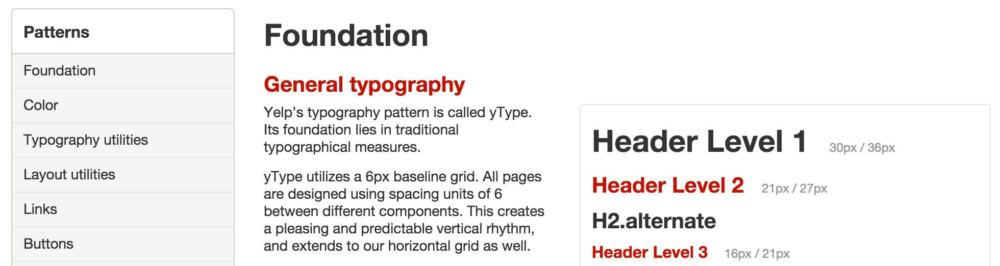

---

Sticky.

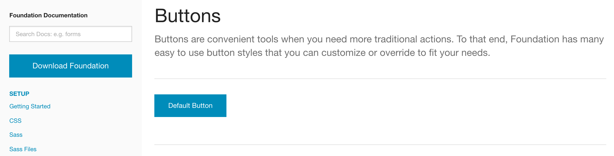

---

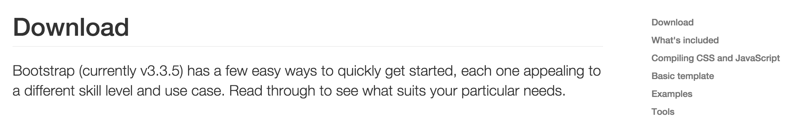

## Colors ##

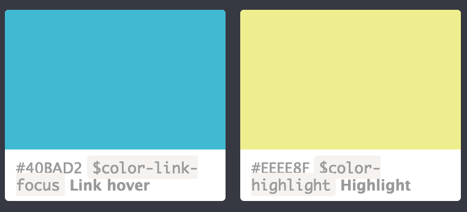

---

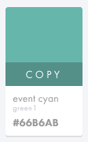

## Components ##

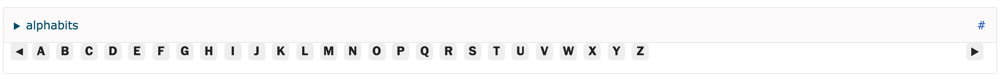

---

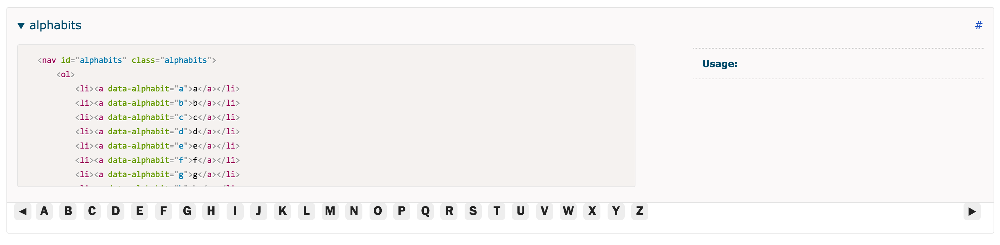

---

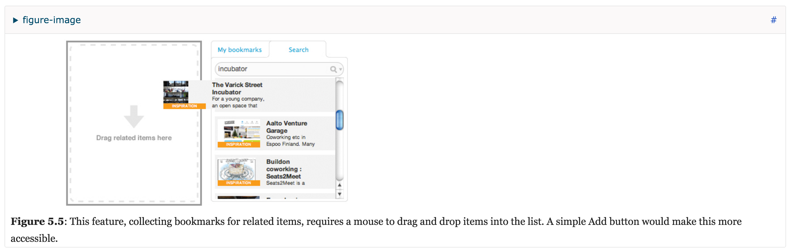

---

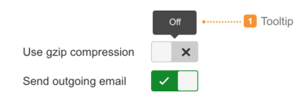

---

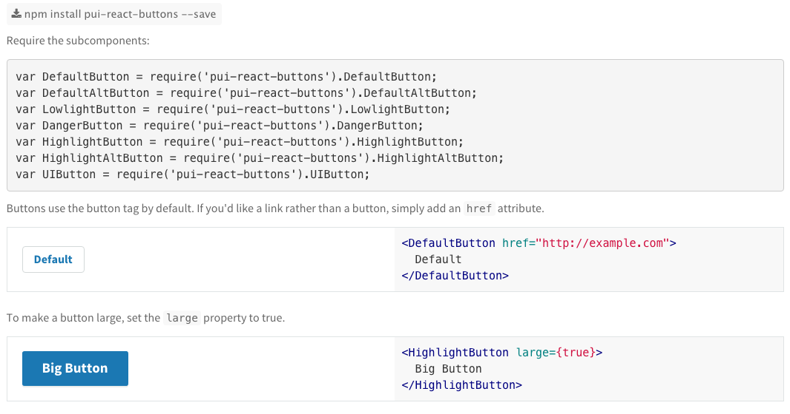

## UI Elements ##

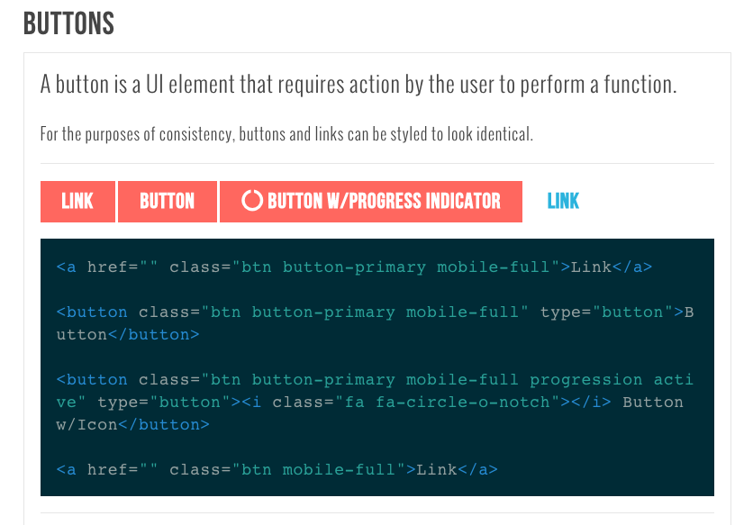

---

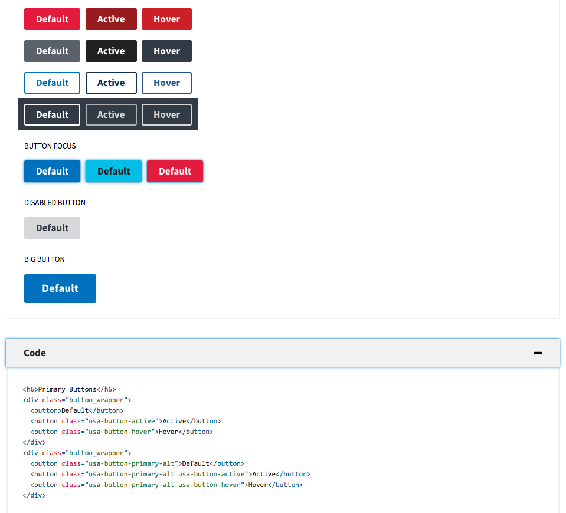

## Fonts ##

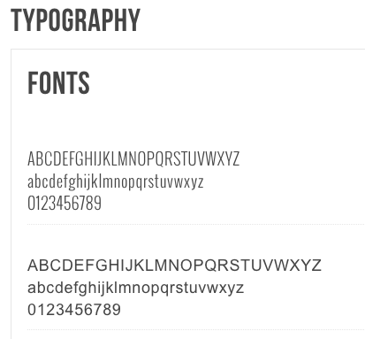

---

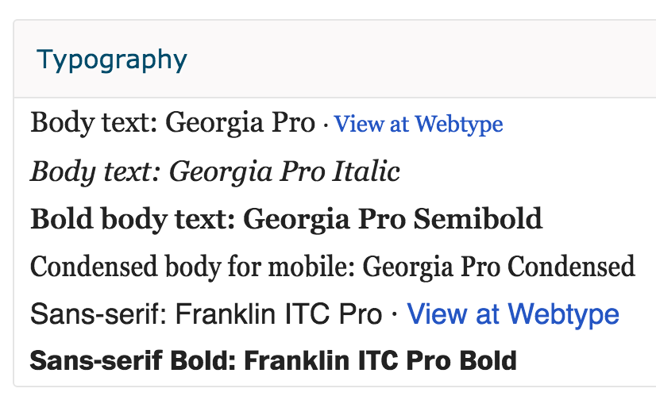

---

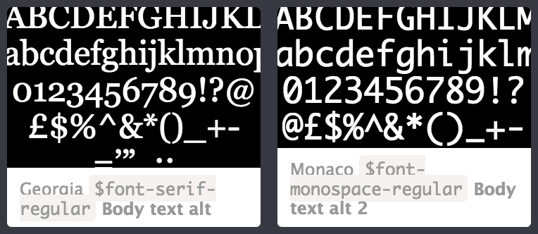

---

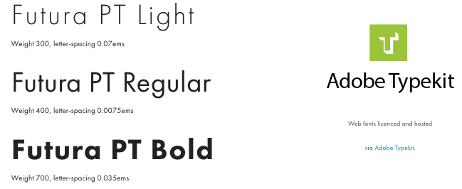

## Typography ##

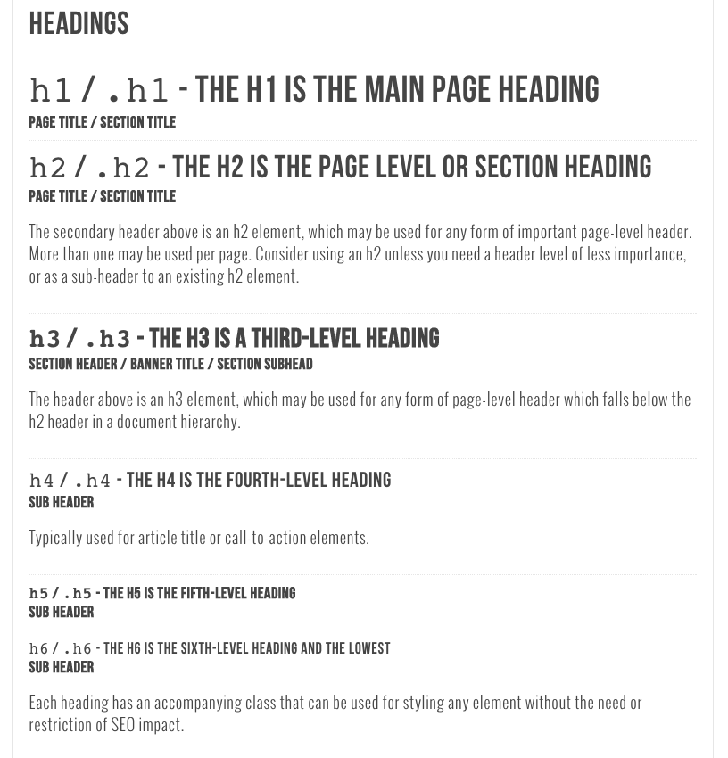

## Extras ##

### Code Blocks ###

Code blocks already hidden on start. 

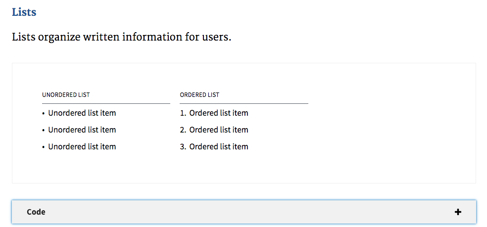

---

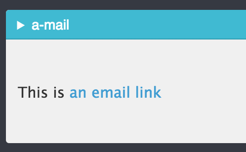

---

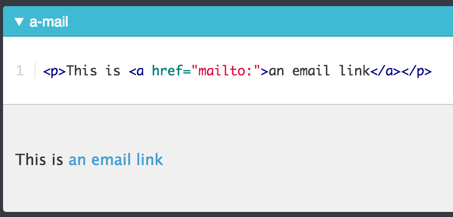

### Icons ###

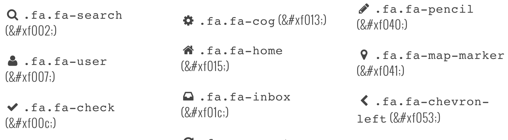

### Responsive ###

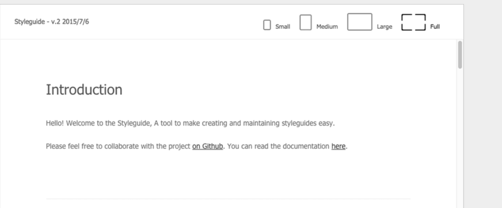