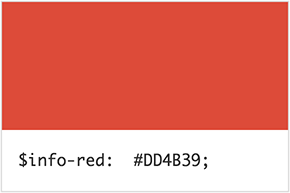
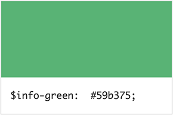
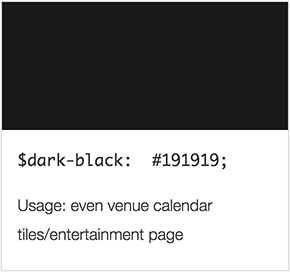
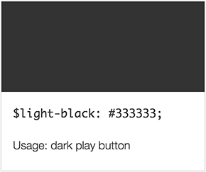
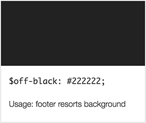
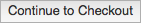
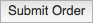

# Table of Contents #

- [Color Palette](#color-palette)
    - [Bright Colors](#bright-colors)
    - [Dark Colors](#dark-colors)
- [UI Elements](#ui-elements)
    - [Buttons](#buttons)
    - [Lists](#lists)
- [Fonts](#fonts)
    - [Primary Fonts](#primary-fonts)
    - [Secondary Fonts](#secondary-fonts)


---


# Color Palette #


## Bright Colors ##






## Dark Colors ##







File: [`library/styles/global/colors.css`](library/styles/global/colors.css)

---


# UI Elements #


## Buttons ##

Lorem ipsum dolor sit amet, consectetur adipisicing elit, sed do eiusmod tempor incididunt ut labore et dolore magna aliqua. Ut enim ad minim veniam, quis nostrud exercitation ullamco laboris nisi ut aliquip ex ea commodo consequat.

**Example**: Call to Action 

<a class="btn" href="#">Learn More 👉🏻</a>

```html
<a class="btn" href="#">Learn More 👉🏻</a>
```

**Example**: Basic Button



```html
<button class="btn">Continue to Checkout</button>
```

**Example**: Submit Button



```html
<button class="btn">Submit Order</button>
```

<dl>
	<dt>Modifier: <code>.class-name-1</code></dt>
  <dd>Lorem ipsum dolor sit amet, consectetur adipisicing elit, sed do eiusmod tempor incididunt ut labore et dolore magna aliqua. Ut enim ad minim veniam.</dd>
	<dt>State: <code>:hover</code></dt>
  <dd>Lorem ipsum dolor sit amet, consectetur adipisicing elit, sed do eiusmod tempor incididunt ut labore et dolore magna aliqua. Ut enim ad minim veniam.</dd>
</dl>

File: [`library/styles/global/buttons.css`](library/styles/global/buttons.css)


## Lists ##

**Example**: Bulleted List

<ul>
  <li>Item 1</li>
  <li>Item 2</li>
  <li>Item 3</li>
  <li>Item 4</li>
  <li>Item 5</li>
  <li>Item 6</li>
</ul>

```html
<ul>
  <li>Item 1</li>
  <li>Item 2</li>
  <li>Item 3</li>
  <li>Item 4</li>
  <li>Item 5</li>
  <li>Item 6</li>
</ul>
```

**Example**: Numbered List

<ol>
  <li>Item 1</li>
  <li>Item 2</li>
  <li>Item 3</li>
  <li>Item 4</li>
  <li>Item 5</li>
  <li>Item 6</li>
</ol>

```html
<ol>
  <li>Item 1</li>
  <li>Item 2</li>
  <li>Item 3</li>
  <li>Item 4</li>
  <li>Item 5</li>
  <li>Item 6</li>
</ol>
```

<dl>
	<dt>Modifier: <code>.class-name-1</code></dt>
  <dd>Lorem ipsum dolor sit amet, consectetur adipisicing elit, sed do eiusmod tempor incididunt ut labore et dolore magna aliqua. Ut enim ad minim veniam.</dd>
	<dt>Modifier: <code>.class-name-2</code></dt>
  <dd>Lorem ipsum dolor sit amet, consectetur adipisicing elit, sed do eiusmod tempor incididunt ut labore et dolore magna aliqua. Ut enim ad minim veniam.</dd>
</dl>

File: [`library/styles/global/lists.css`](library/styles/global/lists.css)

---


# Fonts #


## Primary Fonts ##

> <h4>The quick brown fox jumps over the lazy dog.</h4>

| Variable Name     | Font Sequence                             |  
| :---------------- | :---------------------------------------- |  
| `$font-primary-1` | `'Helvetica Neue 55 Roman', 'sans-serif'` |  

> <h4>The quick brown fox jumps over the lazy dog.</h4>

| Variable          | Font Sequence                             |  
| :---------------- | :---------------------------------------- |  
| `$font-primary-2` | `'Helvetica Neue 73 Bold Extended', 'sans-serif'`          |  


## Secondary Fonts ##

> <h4><samp>The quick brown fox jumps over the lazy dog.<samp></h4>

| Variable          | Font Sequence        |  
| :---------------- | :------------------- |  
| `$font-secondary` | `'Courier', 'monospaced'` |  


File: [`library/styles/global/fonts.css`](library/styles/global/fonts.css)

---

Copyright 2016 | SapientNitro | Last Modified: January 5, 2016
