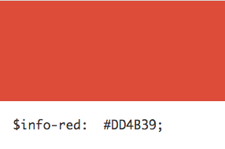
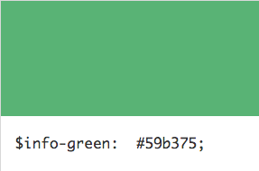
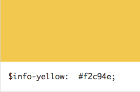
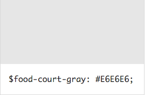

# Table of Contents #

  - [Section Title: Color](#section-title-color)
  	- [Secondary Section Title: colors.css](#secondary-section-title-colors-css)
  		- [Tertiary Section Title: Primary Colors](#tertiary-section-title-primary-colors)
  		- [Tertiary Section Title: Accent Colors](#tertiary-section-title-accent-colors)
  - [Section Title: UI](#section-title-ui)
  	- [Secondary Section Title: buttons.css](#secondary-section-title-buttons-css)
    	- [Tertiary Section Title: Buttons](#tertiary-section-title-buttons)
    - [Secondary Section Title: lists.css](#secondary-section-title-lists-css)
    	- [Tertiary Section Title: Lists](#tertiary-section-title-lists)
  - [Section Title: Typography](#section-title-typography)
  	- [Secondary Section Title: typography.css](#secondary-section-title-typography-css)
    	- [Tertiary Section Title: Helvetica Neue](#tertiary-section-title-helvetica-neue)
    	- [Tertiary Section Title: Georgia](#tertiary-section-title-georgia)

---

# Section Title: Color #


## Secondary Section Title: `colors.css` ##

Path: [`library/styles/global/colors.css`](library/styles/global/colors.css)


### Tertiary Section Title: Primary Colors ###










### Tertiary Section Title: Accent Colors ###


---

# Section Title: UI #

## Secondary Title: `buttons.css` ##

Path: [`library/styles/global/buttons.css`](library/styles/global/buttons.css)

### Tertiary Section Title: Buttons ###

| Example: CTA |
| :----------- |
| <a class="btn" href="#">Call to Action</a> |
| ``` <a class="btn" href="#">Call to Action</a> ``` |

| Example: Basic Button |
| :-------------------- |
| <button class="btn">Basic</button> |
| ``` <button class="btn">Basic</button> ``` |

| Example: Submit Button |
| :--------------------- |
| <button class="btn">Basic</button> |
| ``` <button class="btn">Basic</button> ``` |

<dl>
	<dt>Modifier: <code>.class-name-1</code></dt>

  <dd>Lorem ipsum dolor sit amet, consectetur adipisicing elit, sed do eiusmod tempor incididunt ut labore et dolore magna aliqua. Ut enim ad minim veniam.</dd>

	<dt>Modifier: <code>.class-name-2</code></dt>

  <dd>Lorem ipsum dolor sit amet, consectetur adipisicing elit, sed do eiusmod tempor incididunt ut labore et dolore magna aliqua. Ut enim ad minim veniam.</dd>
</dl>

## Secondary Title: `lists.css` ##

Path: [`library/styles/global/lists.css`](library/styles/global/lists.css)

### Tertiary Section Title: Lists ###

| Example: Bullets |
| :--------------- |
| <ul><li>Item 1</li><li>Item 2</li></ul> |
| ``` <ul><li>Item 1</li><li>Item 2</li></ul> ``` |

| Example: Numbered |
| :-------------------- |
| <ol><li>Item 1</li><li>Item 2</li></ol> |
| ``` <ol><li>Item 1</li><li>Item 2</li></ol> ``` |

<dl>
	<dt>Modifier: <code>.class-name-1</code></dt>

  <dd>Lorem ipsum dolor sit amet, consectetur adipisicing elit, sed do eiusmod tempor incididunt ut labore et dolore magna aliqua. Ut enim ad minim veniam.</dd>

	<dt>Modifier: <code>.class-name-2</code></dt>

  <dd>Lorem ipsum dolor sit amet, consectetur adipisicing elit, sed do eiusmod tempor incididunt ut labore et dolore magna aliqua. Ut enim ad minim veniam.</dd>
</dl>

---

# Section Title: Typography #

## Secondary Title: `typography.css` ##

File: [`library/styles/global/fonts.css`](library/styles/global/fonts.css)

### Tertiary Section Title: Helvetica Neue ###


> <h4>The quick brown fox jumps over the lazy dog.</h4>

| Variable | Font Sequence |
| :---------- | :------- |
| $font-primary | `'Helvetica Neue', 'sans-serif'` |


### Tertiary Section Title: Georgia ###

> <h4>The quick brown fox jumps over the lazy dog.</h4>

| Variable | Font Sequence |
| :---------- | :------- |
| $font-secondary | `'Georgia', 'serif'` |


---

<small>Copyright 2016 | SapientNitro | Last Modified: January 5, 2016</small>
